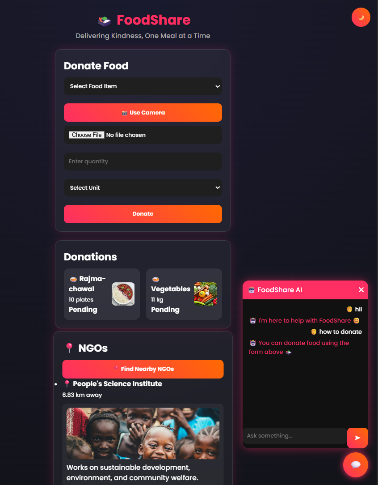
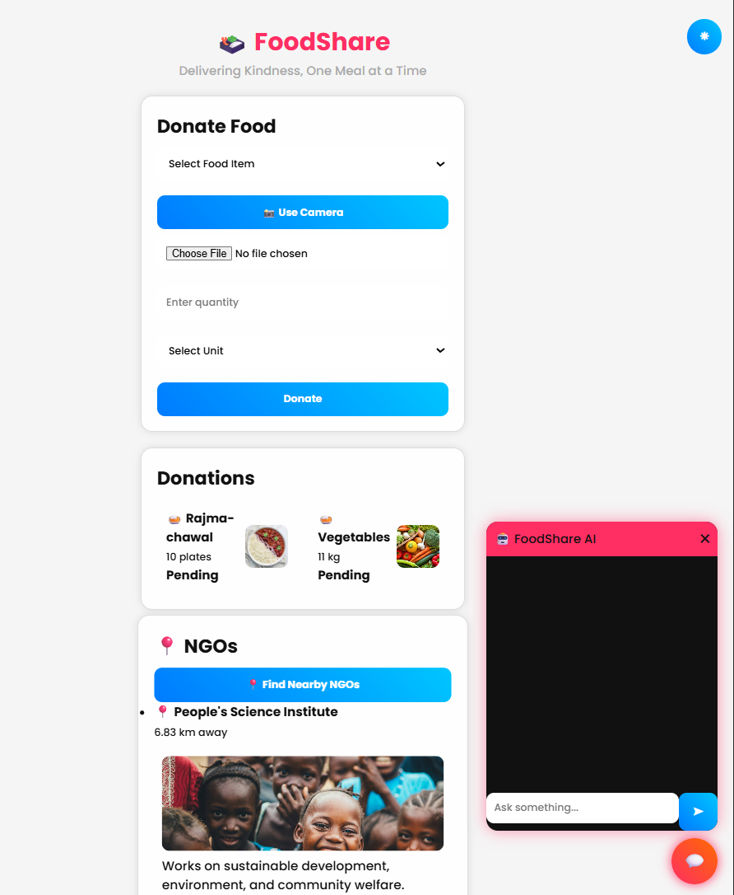

# 🍱 FoodShare – Smart Food Redistribution System

FoodShare is a modern web-based platform designed to reduce food wastage by connecting food donors with NGOs. It enables users to donate surplus food easily while NGOs manage and distribute it efficiently.

---

## 🚀 Features

- 🍛 Donate food with quantity & units
- 📸 Image upload + AI food detection (TensorFlow MobileNet)
- 📍 Nearby NGO finder using Geolocation API
- 📊 Dashboard to track donations
- ✅ Mark donations as completed
- 🌙 Dark / Light theme toggle
- 🤖 AI Chatbot with typing animation
- 🎨 Modern responsive UI (glassmorphism design)

---

## 🛠️ Tech Stack

| Category | Technology |
|----------|-----------|
| Frontend | HTML, CSS, JavaScript |
| Backend | Node.js, Express.js |
| Storage | JSON (data.json) |
| AI Model | TensorFlow.js (MobileNet) |

---

## 📂 Project Structure
FoodShare/
│
├── index.html
├── dashboard.html
├── login.html
├── style.css
├── script.js
├── images/
│
├── server.js
├── data.json
└── README.md


---

## 📸 Screenshots

### 🏠 Home Page


### 📊 Dashboard



---
## ⚙️ How to Run Locally

1. Install Node.js  
2. Open terminal in project folder  

```bash
npm install express
node server.js
Open browser:
http://localhost:3000

```

---


🌍 Live Demo (GitHub Pages)

👉 https://rajwant-raj.github.io/foodshare/

⚠️ Note:
GitHub Pages supports only frontend. Backend features like saving donations will not work.

📍 Key Modules
🍱 Donation System

Users can select food items, add quantity, upload images, and donate food.

📊 Dashboard

Displays all donations with status tracking (Pending / Completed).

📍 NGO Finder

Uses location to find nearby NGOs with images, descriptions, and links.

🤖 AI Chatbot

Provides assistance with typing animation and smart responses.


---


⚠️ Limitations

Uses JSON instead of database

Basic authentication system

Backend not supported on GitHub Pages

AI detection may not be 100% accurate


---


🚀 Future Enhancements

MongoDB database integration

Real-time notifications

Google Maps navigation

Full authentication system

Mobile app version

Deploy full-stack (backend + frontend)


---


🧠 Learning Outcomes

Full-stack web development

REST API integration

AI model usage in frontend

UI/UX design principles

Debugging and deployment


---

---
📌 Author

👤 Rajwant Raj

🎓 CSE Student


----


⭐ Support

If you like this project, give it a ⭐ on GitHub!
